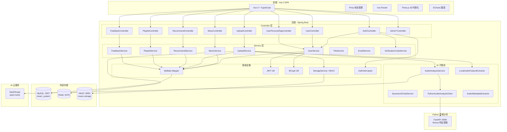
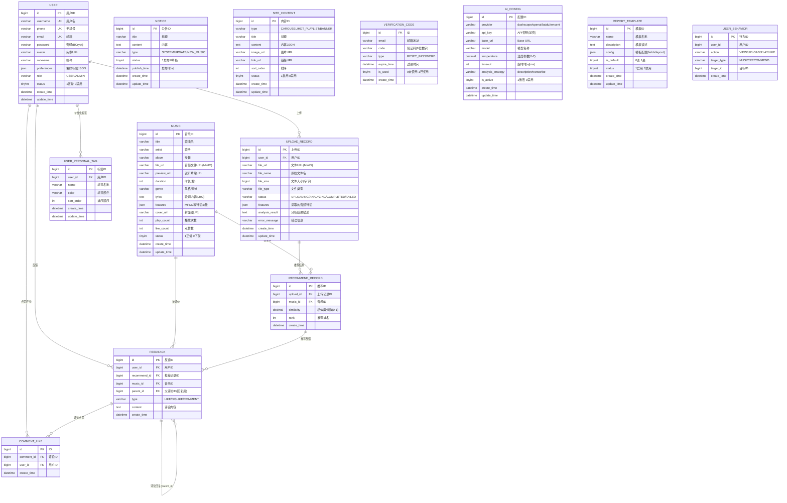
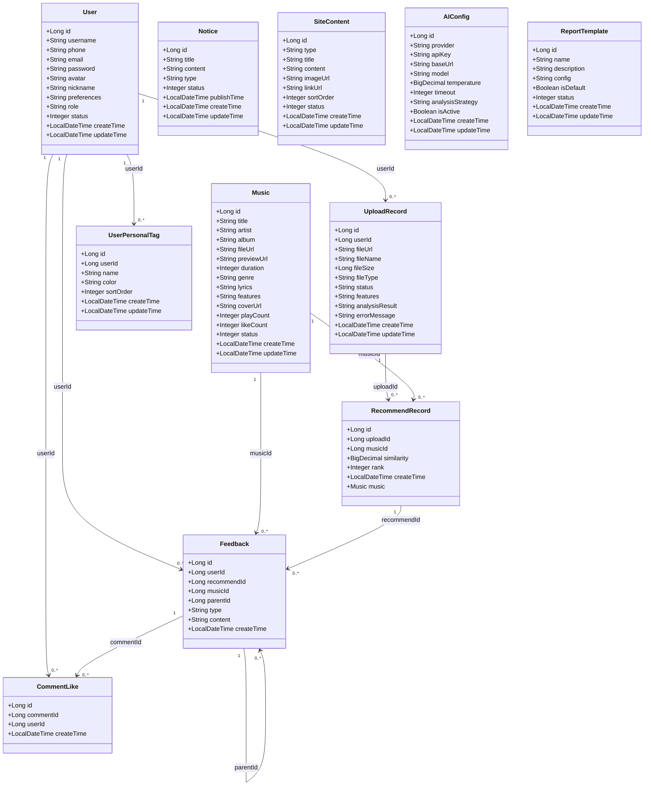
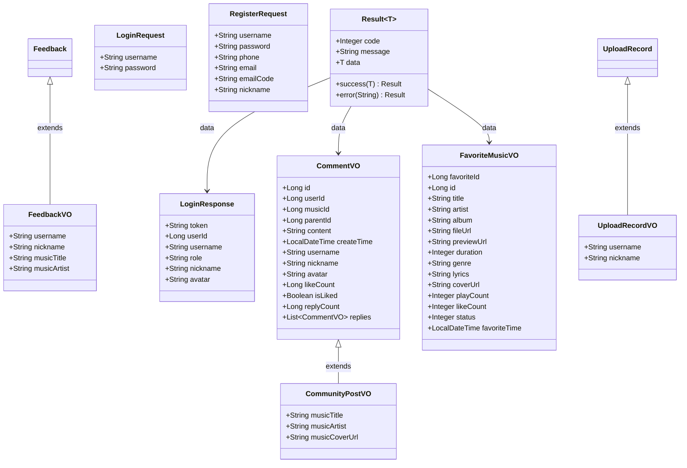
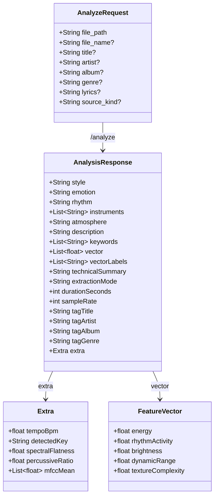

# 个性化音乐推荐系统 — 完整类模型图

以下 5 张 Mermaid 图覆盖系统架构、数据库、实体类、DTO/VO、Python 音频分析服务。
在 VS Code 安装 "Markdown Preview Mermaid Support" 插件即可预览。

---

## 一、系统整体架构图

---

## 二、数据库 ER 图（13 张表）

---

## 三、Java 实体类图

---

## 四、DTO/VO 请求-响应类图

---

## 五、Python 音频分析服务模型

