# 个性化音乐推荐系统 — 时序图

> 每张图覆盖完整调用链：**Controller → Service → Mapper → Database / 外部服务**

---

## 一、用户认证与资料维护

### 1.1 用户注册

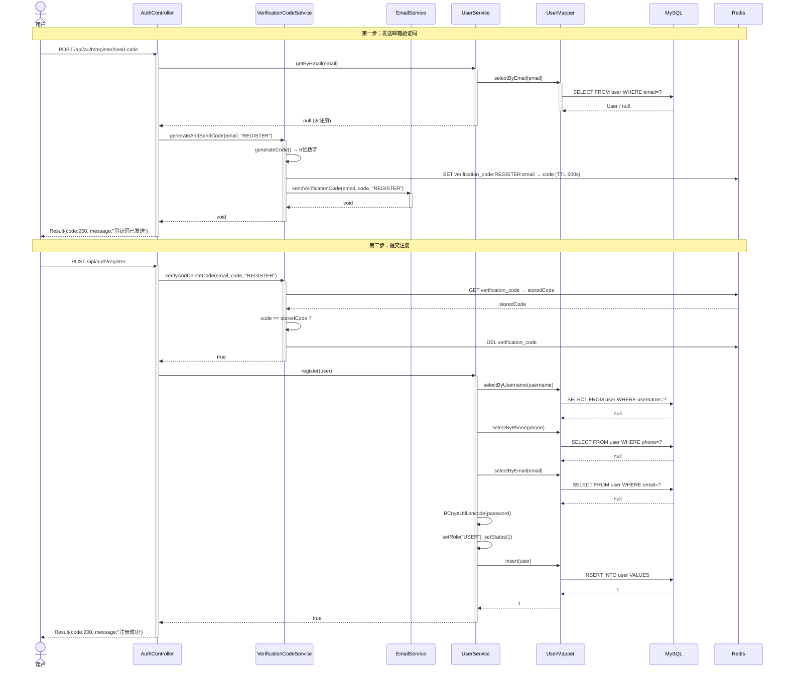

### 1.2 用户登录

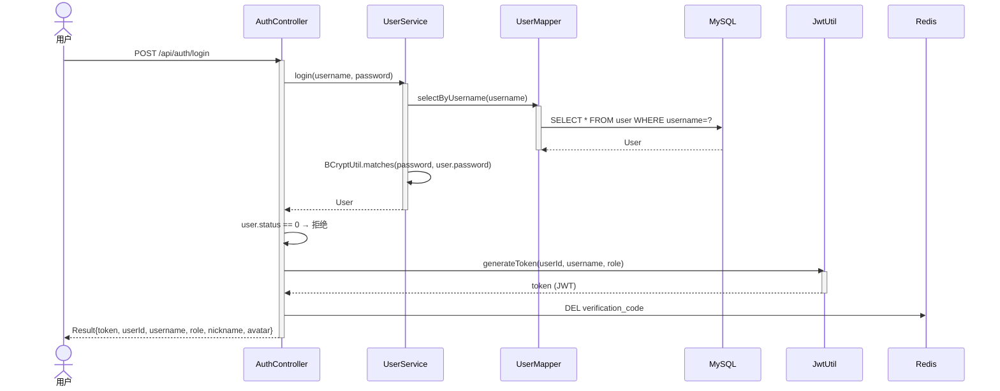

### 1.3 忘记密码 → 重置密码

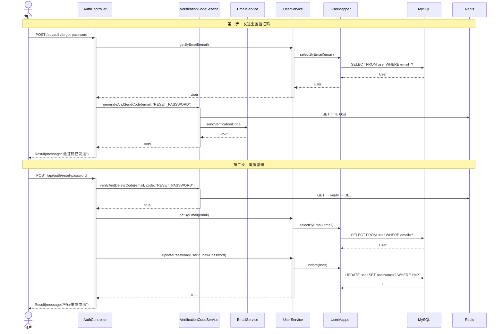

### 1.4 获取/更新个人资料 & 上传头像 & 修改密码

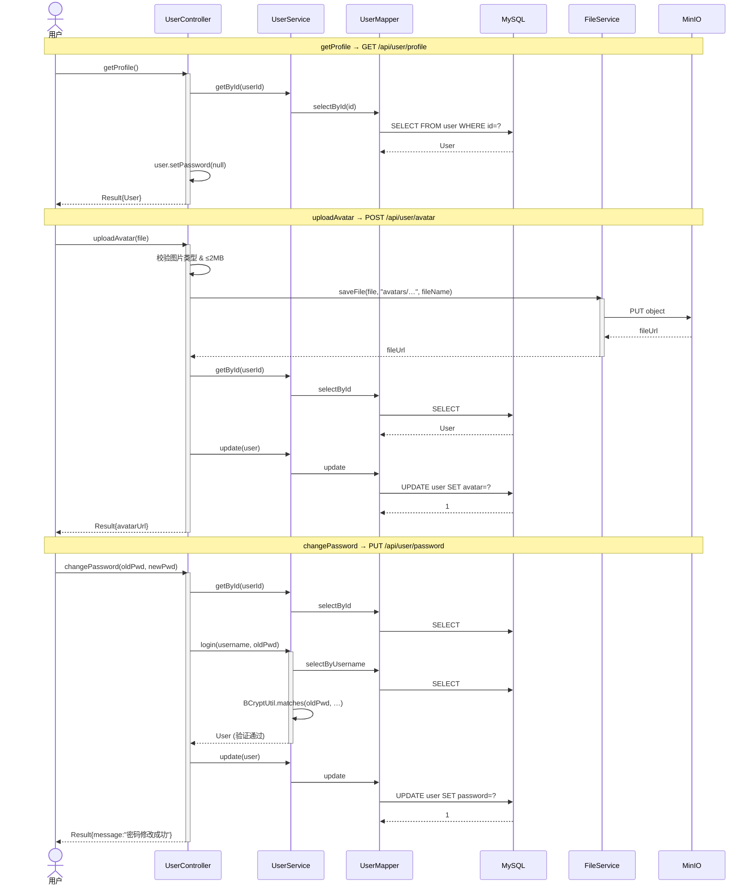

### 1.5 退出登录

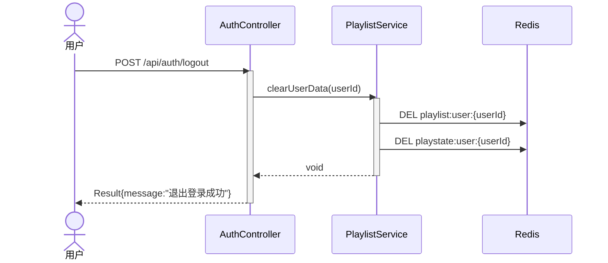

---

## 二、音频 AI 推荐

### 2.1 用户上传音频 → AI 分析 → 生成推荐

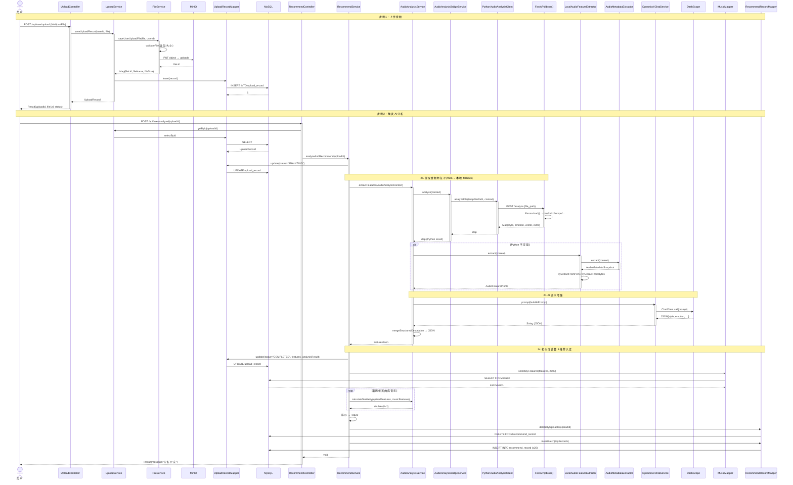

### 2.2 获取推荐结果

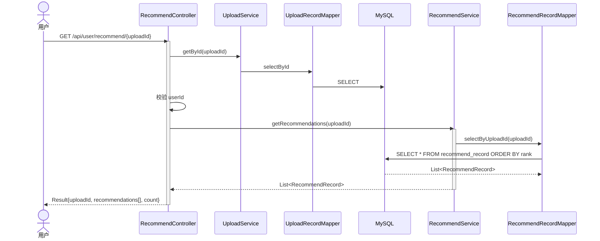

---

## 三、音乐浏览

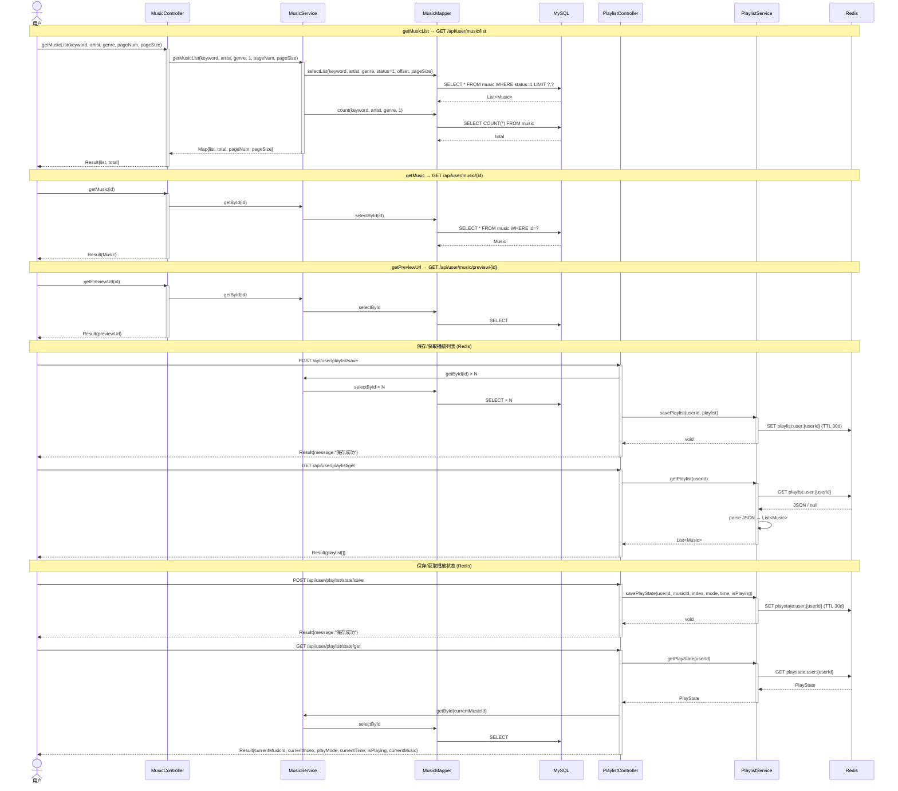

---

## 四、社区互动

### 4.1 歌曲评论 & 回复 & 删除

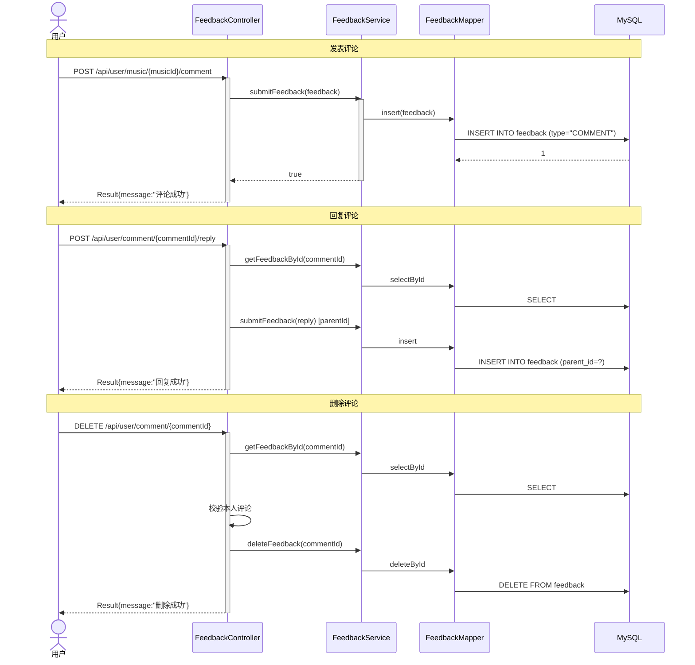

### 4.2 评论点赞 & 社区动态 & 歌曲点赞 & 收藏

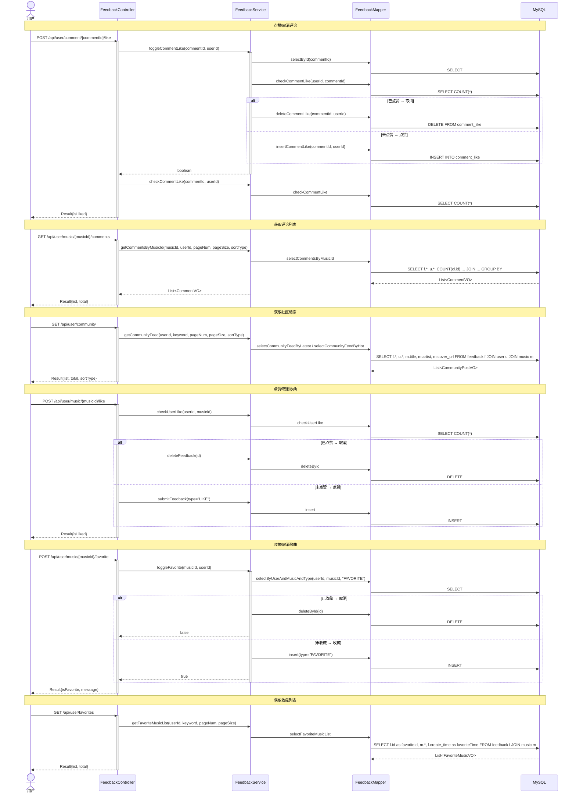

---

## 五、内容资源管理（Admin）

### 5.1 音乐库 CRUD

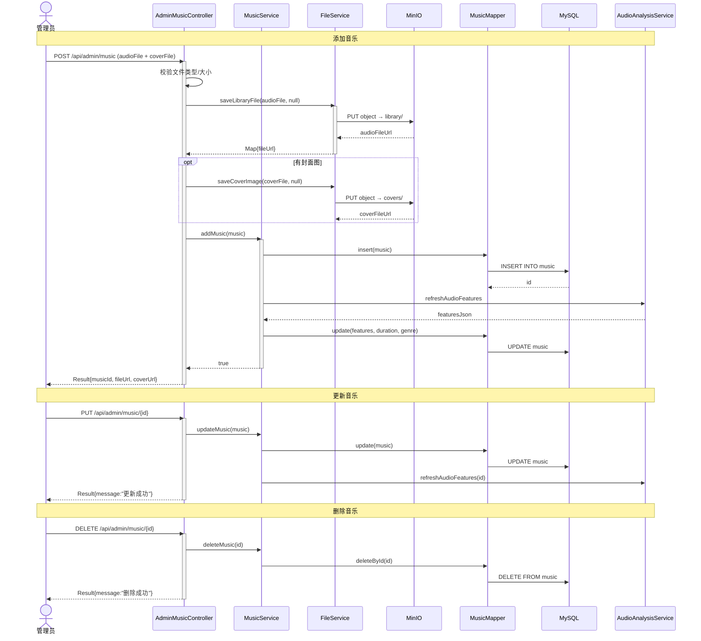

### 5.2 上传记录 & 通知公告 & 站点内容

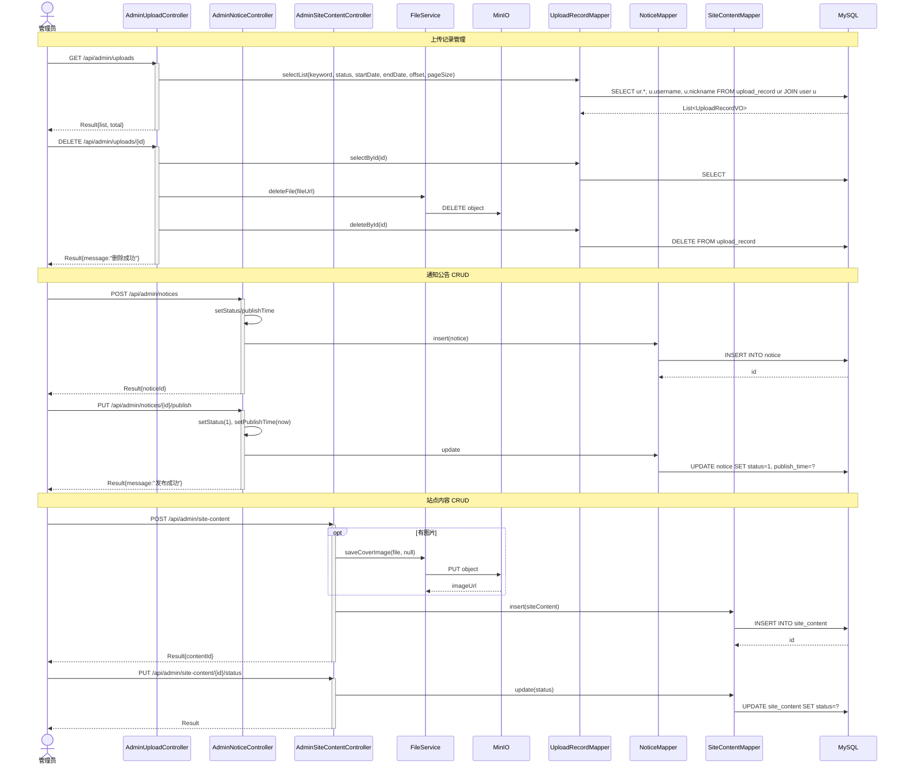

---

## 六、用户社区与 AI 管理（Admin）

### 6.1 用户管理 & 反馈管理

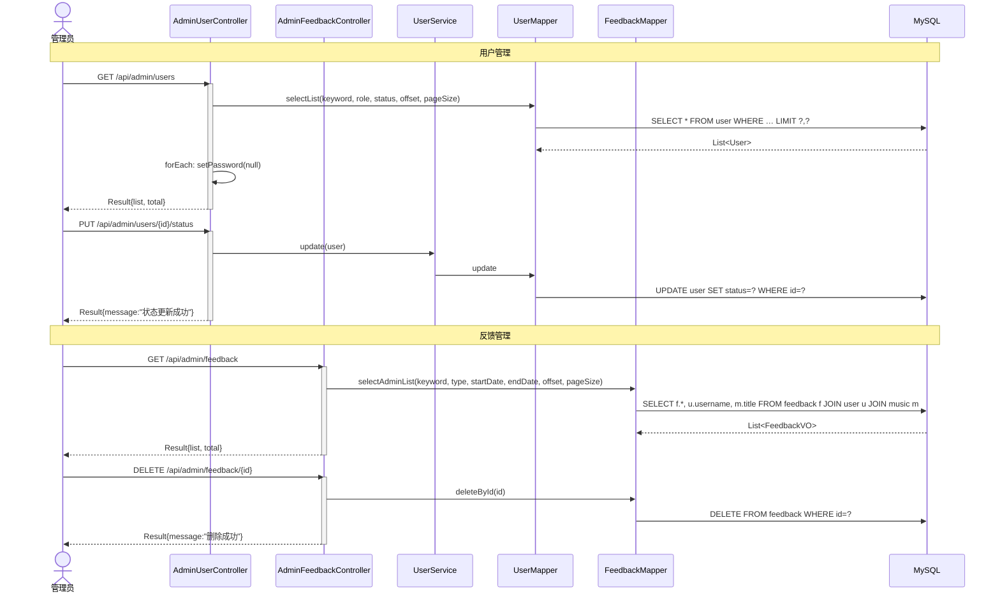

### 6.2 AI 配置管理 & AI 监控 & 仪表盘

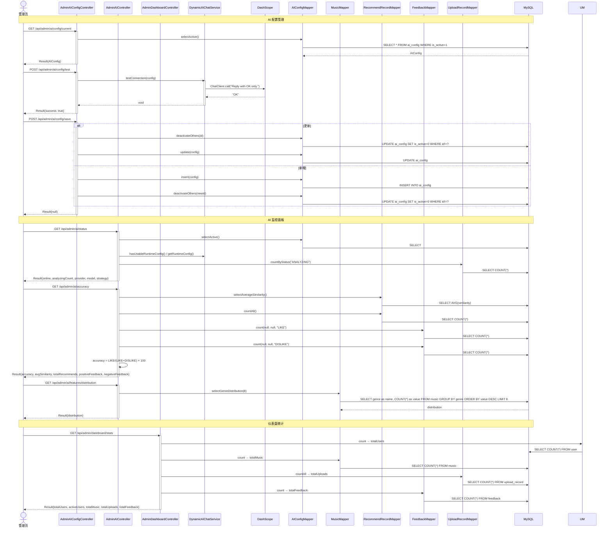

---

## 文件清单

| 文件 | 内容 |
|------|------|
| `E:\MUSIC\docs\class-diagrams.md` | 类图（5张 Mermaid） |
| `E:\MUSIC\docs\sequence-diagrams.md` | 时序图（6张 Mermaid） |
| `E:\MUSIC\docs\01-architecture.puml` | 架构图 PlantUML |
| `E:\MUSIC\docs\02-database-er.puml` | ER 图 PlantUML |
| `E:\MUSIC\docs\03-java-entities.puml` | 实体 PlantUML |
| `E:\MUSIC\docs\04-dto-vo.puml` | DTO/VO PlantUML |
| `E:\MUSIC\docs\05-python-audio.puml` | Python 模型 PlantUML |
